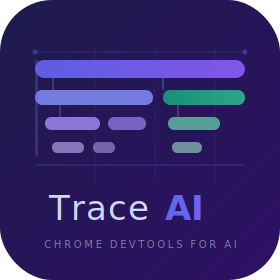

<p align="center">
  
</p>

<h1 align="center">TraceAI</h1>

<p align="center">
  <strong>Chrome DevTools for AI agents.</strong><br/>
  Trace prompts, tool calls, memory, and reasoning in a visual execution timeline — locally, with zero infrastructure.
</p>

<p align="center">
  <a href="https://pypi.org/project/traceai-sdk/"></a>
  <a href="https://pypi.org/project/traceai-sdk/"></a>
  <a href="LICENSE"></a>
  <a href="https://github.com/arnavvj/traceai/actions"></a>
  
</p>

---

## The Problem

AI agents are quickly becoming complex software systems — but developers still debug them as black boxes.

Traditional debugging tools show stack traces, variable states, and execution flow. AI systems add entirely new layers that those tools cannot inspect:

- **Dynamic prompts** that change at runtime
- **Model reasoning steps** that are opaque by nature
- **Tool calls** with side effects scattered across the trace
- **Memory retrieval** from vector stores and caches
- **Multi-agent coordination** across async tasks

When something goes wrong, the typical debugging session looks like this:

```python
print(prompt)
print(response)
```

The equivalent of debugging a distributed system with `printf` statements.

As AI agents grow more complex, this becomes nearly impossible. Developers cannot easily answer basic questions:

> *What exact prompt did the model receive? Why did the agent choose this tool?
> Which memory entries were retrieved? What changed between two runs?*

**TraceAI is the missing primitive** — a universal debugging layer for AI agents that brings DevTools-grade observability to your local development environment.

---

## What is TraceAI?

TraceAI automatically captures every LLM call, tool invocation, memory access, and agent decision in a **structured, searchable, visual timeline** — stored locally in SQLite with no cloud dependency.

```
Your Agent
   │
   ├── 🤖 llm_call  [gpt-4o]     125ms   $0.0012   ← prompt, response, tokens
   ├── 🔧 tool_call [search]      340ms             ← args, result
   ├── 📖 memory_read             12ms              ← query, retrieved docs
   └── 🤖 llm_call  [gpt-4o]     98ms    $0.0009   ← final synthesis
```

Open `traceai open` and every run above becomes a clickable, inspectable, replayable trace.

---

## How TraceAI is Different

Most observability tools are built for **production monitoring** and require infrastructure, cloud accounts, and team setup. TraceAI is built for the **individual developer** who needs to understand what their agent just did.

| Feature | TraceAI | LangSmith | Langfuse | Arize Phoenix | Braintrust |
|---|:---:|:---:|:---:|:---:|:---:|
| `pip install` → working in 30 seconds | ✅ | ❌ | ❌ | ❌ | ❌ |
| Zero cloud / no account required | ✅ | ❌ | ❌ | ❌ | ❌ |
| Zero infrastructure (no Docker) | ✅ | ❌ | ❌ | ❌ | ❌ |
| Framework-agnostic | ✅ | ⚠️ | ✅ | ⚠️ | ✅ |
| Model replay & arbitrage built-in | ✅ | ❌ | ❌ | ❌ | ❌ |
| Side-by-side trace comparison | ✅ | ❌ | ❌ | ✅ | ❌ |
| Multi-provider experiments | ✅ | ❌ | ❌ | ❌ | ✅ |
| Streaming capture | ✅ | ✅ | ✅ | ✅ | ✅ |
| Head sampling | ✅ | ✅ | ✅ | ✅ | ✅ |
| Fully open source | ✅ | ⚠️ | ✅ | ✅ | ❌ |
| Local-first (data never leaves your machine) | ✅ | ❌ | ⚠️ | ⚠️ | ❌ |

> ⚠️ = partial / requires self-hosting

---

## Features

### Auto-Instrumentation
Drop two lines into any existing codebase. TraceAI patches the OpenAI and Anthropic SDKs transparently — no changes to your agent code.

### Visual Dashboard
A React + TypeScript dashboard served from `traceai open`. Browse traces, inspect span trees, view raw inputs/outputs, and navigate the full execution timeline.

### Model Replay & Arbitrage
Re-run any LLM span with a different model. Compare cost, token usage, and output quality side-by-side. Answer *"should I switch from GPT-4o to Claude Haiku?"* with real data from your own workload.

### Experiments
Group multiple runs into a named experiment with `traceai.experiment("name")`. Compare any two traces from the same experiment in the dashboard — even across providers.

### Streaming Support
`stream=True` calls are fully captured. Token counts and content are aggregated from chunks and recorded exactly as non-streaming calls.

### Head Sampling
Control trace volume with `traceai.configure(sample_rate=0.1)`. Sampled-out traces are silent no-ops — zero overhead from span creation or DB writes.

### OTel-Compatible Metadata
Spans carry standard OpenTelemetry GenAI semantic conventions: `gen_ai.system`, `gen_ai.request.model`, `gen_ai.usage.input_tokens`, `gen_ai.response.finish_reason`, and more.

### CLI
Inspect traces without opening a browser: `traceai list`, `traceai inspect <id>`, `traceai export <id>`.

---

## Quick Start

```bash
pip install traceai-sdk
```

### Auto-instrument OpenAI in 2 lines

```python
import traceai
traceai.instrument("openai")

# Your existing code — unchanged
from openai import OpenAI
client = OpenAI()
response = client.chat.completions.create(
    model="gpt-4o",
    messages=[{"role": "user", "content": "Explain gradient descent in two sentences."}],
)
print(response.choices[0].message.content)
```

```bash
traceai open   # launches dashboard at http://localhost:7474
```

Every call is captured automatically: model, messages, response, token counts, cost, duration, finish reason.

### Auto-instrument Anthropic

```python
import traceai
traceai.instrument("anthropic")

import anthropic
client = anthropic.Anthropic()
message = client.messages.create(
    model="claude-sonnet-4-6",
    max_tokens=256,
    messages=[{"role": "user", "content": "Explain gradient descent in two sentences."}],
)
print(message.content[0].text)
```

### Manual instrumentation

Use `@tracer.trace` and `tracer.span()` to instrument any Python code — no LLM framework required:

```python
from traceai import tracer

@tracer.trace
def my_agent(question: str) -> str:
    with tracer.span("retrieve-context", kind="retrieval") as span:
        span.set_input({"query": question})
        docs = vector_store.search(question)
        span.set_output({"doc_count": len(docs)})

    with tracer.span("llm-synthesis", kind="llm_call") as span:
        prompt = build_prompt(question, docs)
        span.set_input({"messages": [{"role": "user", "content": prompt}]})
        answer = call_llm(prompt)
        span.set_output({"content": answer})

    return answer
```

---

## Streaming

Streaming calls are captured transparently — content is buffered from delta events and token counts are extracted from the final chunk:

```python
import traceai
traceai.instrument("openai")

from openai import OpenAI
client = OpenAI()

# stream=True is fully supported — nothing extra needed
stream = client.chat.completions.create(
    model="gpt-4o",
    messages=[{"role": "user", "content": "Count from 1 to 5."}],
    stream=True,
)
for chunk in stream:
    print(chunk.choices[0].delta.content or "", end="", flush=True)
print()
```

The trace will show the full aggregated response, token usage, and `gen_ai.streaming: true` in metadata.

Async streaming works identically:

```python
import asyncio, traceai
traceai.instrument("openai")

from openai import AsyncOpenAI
client = AsyncOpenAI()

async def main():
    stream = await client.chat.completions.create(
        model="gpt-4o",
        messages=[{"role": "user", "content": "Count from 1 to 5."}],
        stream=True,
    )
    async for chunk in stream:
        print(chunk.choices[0].delta.content or "", end="", flush=True)
    print()

asyncio.run(main())
```

---

## Sampling

Control trace volume without changing your agent code:

```python
import traceai

# Capture only 10% of traces globally
traceai.configure(sample_rate=0.1)

# Or set per-function (overrides global rate)
@traceai.tracer.trace(name="high-volume-agent", sample_rate=0.05)
def process_request(text: str) -> str:
    ...
```

Sampled-out traces are **silent no-ops** — the function still executes and returns its value normally; TraceAI simply does not record anything. There is zero overhead from span creation or DB writes.

---

## Experiments & Model Arbitrage

Group multiple runs into a named experiment, then compare them side-by-side in the dashboard:

```python
import traceai

traceai.instrument("openai")
traceai.instrument("anthropic")

import openai, anthropic

PROMPT = "Summarise the Python GIL in one sentence."

with traceai.experiment("python-gil-summary"):
    # Run the same task on two providers
    openai.OpenAI().chat.completions.create(
        model="gpt-4o-mini",
        messages=[{"role": "user", "content": PROMPT}],
    )
    anthropic.Anthropic().messages.create(
        model="claude-haiku-4-5-20251001",
        max_tokens=128,
        messages=[{"role": "user", "content": PROMPT}],
    )
```

```bash
traceai open
# → both traces show ⇄ python-gil-summary badge
# → select both → Compare → side-by-side diff with cost breakdown
```

This is the **model arbitrage** pattern: identical task, different providers, instant cost and quality comparison from your own workload data.

### Replay any trace with a different model

In the dashboard, select any trace → click **↺ Replay All LLM Calls** → pick a target model. TraceAI re-runs every `llm_call` span with the new model and saves the result as a linked trace. The comparison banner shows:

```
↺ Replayed  gpt-4o → claude-haiku-4-5-20251001
Original: $0.042 · 1,200 tok     Replay: $0.003 · 1,100 tok
Cost savings: 93%  ↓   Token delta: −8%
```

---

## Dashboard

```bash
traceai open            # opens http://localhost:7474
traceai open --port 8080 --no-browser   # headless / custom port
```

The dashboard provides:

- **Trace list** — browse all traces with duration, cost, token count, status
- **Span tree** — visual waterfall showing parent/child span relationships
- **Span detail** — full inputs, outputs, metadata, and error details for any span
- **Compare view** — side-by-side diff of any two traces from the same experiment or replay family
- **Replay panel** — re-run spans or entire traces with a different model
- **Experiments tab** — aggregate stats (total cost, tokens, run count) per experiment

---

## CLI Reference

```
traceai list [--limit N] [--status ok|error|pending] [--db PATH]
```
List recent traces in a table. Columns: ID, name, status, duration, tokens, cost, timestamp.

```
traceai inspect <TRACE_ID> [--db PATH]
```
Render the full span tree for a trace, with inputs/outputs for each node.

```
traceai export <TRACE_ID> [--db PATH]
```
Print the trace and all its spans as JSON (pipe-friendly).

```
traceai delete <TRACE_ID> [--db PATH]
```
Delete a trace and all its spans.

```
traceai open [--port PORT] [--host HOST] [--no-browser] [--db PATH]
```
Start the dashboard server and open a browser tab.

```
traceai config show
traceai config set <KEY> <VALUE>
traceai config get <KEY>
```
Manage configuration stored at `~/.traceai/config.toml`.

---

## Architecture

```
┌─────────────────────────────────────────────────────────┐
│                       Your Agent                        │
│                                                         │
│   @tracer.trace    tracer.span()    instrument("openai") │
└────────────────────┬────────────────────────────────────┘
                     │ async-safe ContextVar propagation
                     ▼
┌─────────────────────────────────────────────────────────┐
│                     TraceAI Core                        │
│                                                         │
│   Tracer  ──►  Span  ──►  Trace  ──►  TraceStore       │
│   (sampling, experiments, context)   (aiosqlite WAL)   │
└─────────────────────────────────────────────────────────┘
                     │
                     ▼
┌─────────────────────────────────────────────────────────┐
│              FastAPI Server + React Dashboard           │
│                                                         │
│   REST API  ──►  SQLite  ──►  Vite/React/Tailwind UI   │
│   /api/traces   /api/spans  /api/experiments            │
└─────────────────────────────────────────────────────────┘
```

**Storage**: SQLite with WAL mode at `~/.traceai/traces.db`. All data stays on your machine.

**Async safety**: `ContextVar`-based propagation ensures traces are correctly nested even when using `asyncio.gather()` or concurrent tasks.

**Provider integrations**: Thin monkey-patch wrappers over the official SDKs. No forking, no subclassing — just `__wrapped__` attribute preservation and transparent proxy objects for streaming.

---

## Span Kinds

| Kind | Description |
|---|---|
| `llm_call` | A call to a language model |
| `tool_call` | A tool or function invocation |
| `agent_step` | A single reasoning step in an agent loop |
| `retrieval` | A vector store or search query |
| `memory_read` | Reading from a memory store |
| `memory_write` | Writing to a memory store |
| `embedding` | An embedding generation call |
| `custom` | Anything else |

---

## Installation

```bash
# Core (tracer + dashboard + CLI)
pip install traceai-sdk

# With OpenAI auto-instrumentation
pip install "traceai-sdk[openai]"

# With Anthropic auto-instrumentation
pip install "traceai-sdk[anthropic]"

# Both providers
pip install "traceai-sdk[openai,anthropic]"

# Development (tests, linting, type checking)
pip install "traceai-sdk[dev]"
```

Requires Python 3.11+.

---

## Requirements

- Python 3.11 or higher
- No cloud account, no Docker, no server setup
- OpenAI and/or Anthropic keys only needed for auto-instrumented provider calls

---

## Contributing

Contributions are welcome. See [CONTRIBUTING.md](CONTRIBUTING.md) for development setup, coding standards, and the PR process.

Bug reports and feature requests: [open an issue](https://github.com/arnavvj/traceai/issues).

---

## Security

To report a vulnerability, see [SECURITY.md](SECURITY.md).

---

## License

[MIT](LICENSE) — free to use, modify, and distribute.

---

<p align="center">
  <sub>Built with the belief that AI systems deserve the same debugging experience as traditional software.</sub>
</p>
